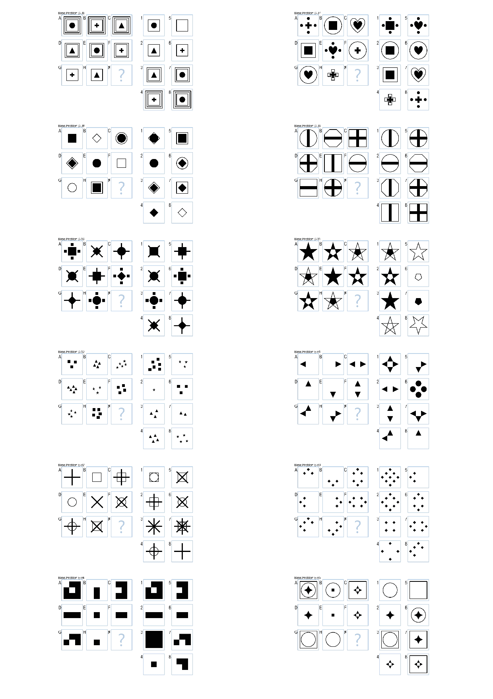
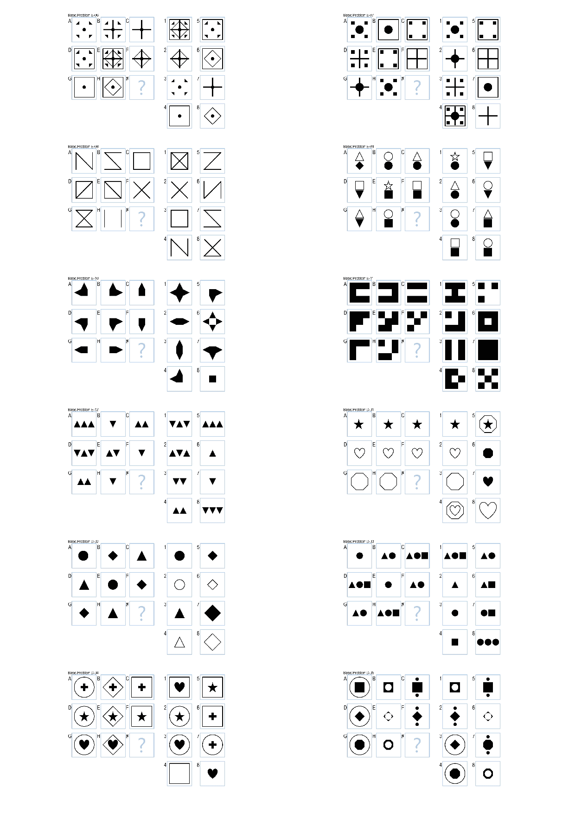

CS7637: Project 3 (Fall 2015)
---

Solving 3x3 RPM using Visual Representations.

It solves the following problems (visual input) with high accuracy (~80%).

My result:

    Set,Correct,Incorrect,Skipped
    Basic Problems D,12,0,0
    Test Problems D,9,0,3
    Basic Problems E,11,1,0
    Test Problems E,9,1,2

Class performance:

|Set | Mean number correct | Median #correct | SD|
|---|---|---|---|
|Basic D | 8.5 | 9   | 2.9|
|Test D |  5.2 | 5   | 2.3|
|Basic E | 8.7 | 10  | 3.1|
|Test E  | 6.4 | 7   | 2.8|

Note:
My implementation is ugly and answer-oriented programming. I didn't enjoy it but I hope it may help you to some extent—an implementation as bad as like this can get a reasonable accuracy.
